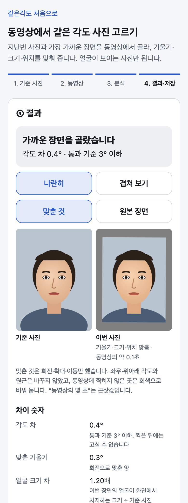
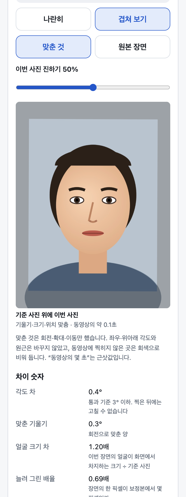
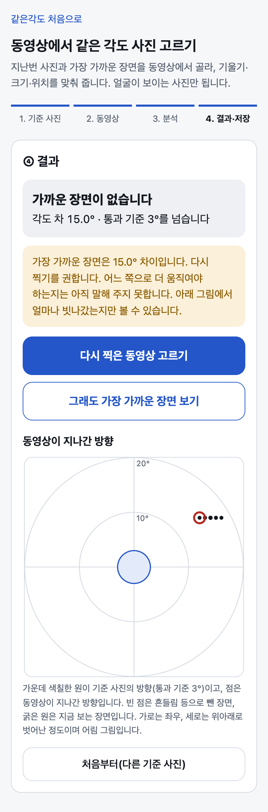

# 같은각도

고개를 천천히 움직이며 찍은 짧은 동영상에서, 지난번 사진과 얼굴 각도가 가장 가까운 장면을 골라 주고 기울기·크기·위치를 맞춰 주는 웹앱입니다. 경과 사진은 나란히 놓을 때만 쓸모가 있는데, 찍는 순간에 사람이 같은 각도·같은 크기를 맞추기는 어렵기 때문입니다.

> **실제 얼굴 동영상으로 검증하기 전입니다.** 계산은 지어낸 숫자(합성 데이터)로만 시험했고, 화면은 코드로 그린 얼굴 그림으로만 돌려 봤습니다. 아이폰에서도 아직 확인하지 못했습니다.

**주소:** https://same-angle.vercel.app (고르는 화면: https://same-angle.vercel.app/pick/)

| ① 첫 화면 | ② 고른 결과 | ③ 겹쳐 보기 | ④ 가까운 장면이 없을 때 |
|---|---|---|---|
| [](docs/screens/1-home.png) | [](docs/screens/3-pick-result.png) | [](docs/screens/4-pick-overlay.png) | [](docs/screens/5-pick-noclose.png) |

②③은 코드로 그린 얼굴 그림과, 그 그림을 기울이고 옮겨 만든 동영상을 넣어 맥 크롬에서 돌린 화면입니다. ④는 지어낸 숫자로 그린 화면입니다. 사람 사진은 없습니다.

## 2026-10-02 에 바뀐 것

- **방향을 바꿨습니다.** 찍는 동안 안내해서 맞추게 하는 도구에서, 찍어 둔 동영상에서 고르는 도구로.
- 새 화면 `/pick/` 이 생겼습니다. 지난번 사진 1장과 10~15초 동영상 1개를 고르면, 가장 가까운 장면을 나란히·겹쳐 보여 주고 맞춘 사진·원본 장면·기록을 저장합니다.
- 아이폰 카메라를 재는 점검 페이지 `/spike/` 는 그대로 두고, 첫 화면 아래 '기술 점검'으로 옮겼습니다.

## 믿을 수 있게 하는 장치

- 서버가 없고, 사진·동영상은 기기 밖으로 보내지 않습니다. 허용 목록 밖 요청은 코드에서 막습니다.
- 가까운 장면이 없으면 없다고 말하고 다시 찍기를 권합니다. 통과 기준을 넘는 장면에는 "가까운 장면"이라는 말을 붙이지 않습니다.
- 맞출 때는 회전·확대·이동만 합니다. 각도나 원근을 바꾸거나 찍히지 않은 곳을 채우지 않습니다. 원본 장면도 함께 저장합니다.
- 정해 둔 규칙으로 고르고, 판정에 쓴 숫자와 기준값을 기록 파일에 남깁니다.

## 지금 숫자

| 항목 | 값 |
|---|---|
| 실제 얼굴 사진·동영상으로 돌려 본 횟수 | 0회 |
| 아이폰에서 돌려 본 횟수 | 0회 |
| 각도 차 통과 기준 | 3° 이하 (조사로 정한 초깃값, 확정 전) |
| 자동 시험 | 749개 통과 (`npm run verify`, 2026-10-02, 전부 합성 데이터) |
| 규칙 문서만 보고 따로 쓴 계산과 견준 결과 | 200개 중 200개 일치. 처음엔 183개였고, 찾은 결함 1건을 고치고 문서에 없던 규칙 1건을 적은 뒤 |
| 일부러 결함을 넣었을 때 시험이 잡은 수 | 165개 중 162개. 남은 3개는 결과가 같아 잡을 수 없다고 봄 |
| 그린 얼굴 그림과 8초 동영상(1080×1440)을 맥 크롬에서 분석한 시간 | 먼저 나오는 답 약 1초, 결과까지 약 3초 (참고용) |
| 인터넷에서 받는 외부 파일 | 얼굴 모델 1개, 약 3.6MB (Google 서버) |

## 실행 방법

```sh
npm install          # node ^20.19.0 || ^22.13.0 || >=24, npm 10 이상
npm run dev          # http://localhost:3000
npm run verify       # test → typecheck → lint → build
npm run preview      # 빌드한 것을 배포와 같은 헤더로: http://localhost:3100/pick/
```

## 한계

- 얼굴이 보이는 사진만 돕습니다. 모발 사진에서 중요한 정수리·뒤통수 사진은 각도를 잴 수 없어 멈춥니다.
- 동영상의 한 장면은 사진보다 화질이 낮습니다. 화질이 충분한지는 이 도구가 답하지 못합니다.
- 병원 현장에서 써 보지 않았습니다. 사용자는 가정한 사람입니다.
- 모발·두피 상태나 치료 효과는 판단하지 않습니다. 의료기기로 허가받은 제품이 아닙니다.
- 얼굴 모델을 받을 때 폰의 IP 가 Google 에 전달됩니다. 막는 장치가 아이폰에서 통하는지는 확인 전입니다.

## 자세히

- [세부 설명](docs/DETAILS.md) — 화면 흐름, 멈추는 경우, 저장 파일, 확인한 것과 못 한 것, 알려진 문제, 네트워크 경계, 점검 페이지
- [실제 얼굴 동영상으로 확인하는 순서](docs/DETAILS.md#실제-얼굴-동영상으로-확인하는-순서아직-안-함) — 아직 하지 않았습니다
- [설계 문서](docs/PRD.md) — 고르기·보정 규칙과 초깃값(v0.3)
- [기술 노트](docs/TECH-NOTES.md)

## 기술 스택

Next.js 15.5.25 정적 내보내기, React 19.1.0, `@mediapipe/tasks-vision` 1.0.1, vitest 3.2.7.

설계 문서와 코드의 초안은 AI 코딩 도구(Claude Code)가 썼습니다. 동영상에서 고르는 쪽으로 방향을 바꾼 것은 제가 정했고, 통과 기준 확정도 제 몫입니다.
