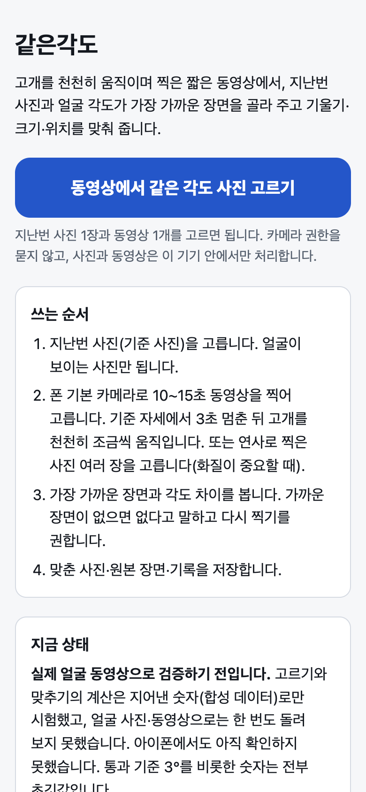
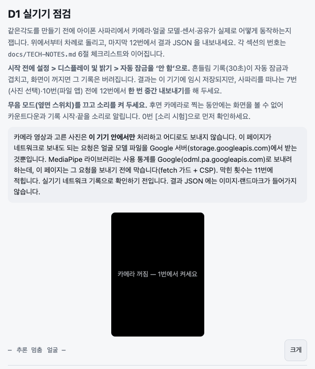

# 같은각도

경과 사진을 지난번 기준 사진과 같은 각도·거리·위치로 찍도록 돕는 웹앱입니다. 고개가 몇 도만 숙여져도 달라진 게 변화 때문인지 찍는 조건 때문인지 가릴 수 없어서입니다.

> 만드는 중입니다. 지금 있는 것은 아이폰 카메라 동작을 재는 점검 페이지뿐이고, 촬영 안내·비교 화면과 시연 주소는 아직 없습니다.

| ① 첫 화면 | ② 아이폰 점검 페이지 |
|---|---|
| [](docs/screens/1-home.png) | [](docs/screens/2-spike.png) |
| 무엇인지, 지금 상태, 의료기기가 아니라는 고지 | 맥에서 연 첫 화면. 카메라는 아직 켜지 않은 상태 |

## 만들려는 것

- 기준 사진을 화면에 겹쳐 띄우고, 어긋나면 "한 걸음 뒤로"처럼 한 번에 하나씩 알려 줍니다.
- 얼굴이 보이는 사진은 고개 각도·거리·위치가 맞으면 자동으로 찍습니다.
- 정수리처럼 얼굴이 안 보이는 사진은 겹쳐 보기·수평·밝기·흔들림만 보고, 셔터는 사람이 누릅니다.
- 사진마다 어떤 조건으로 찍었는지 기록을 남기고, 빠진 사진을 알려 줍니다.

## 믿을 수 있게 하는 장치

- 서버가 없고, 사진·영상은 기기 밖으로 보내지 않습니다. 허용 목록 밖 요청은 코드에서 막습니다.
- 판단이 애매하면 자동으로 찍지 않고 이유를 보여 주도록 설계했습니다.
- 정해 둔 규칙으로 판정하고, 통과 기준을 화면에 그대로 보여 주도록 설계했습니다.

## 지금 숫자

| 항목 | 값 |
|---|---|
| 아이폰에서 돌려 본 횟수 | 0회 (카메라 없는 맥에서만 확인) |
| 고개 각도 통과 기준 | 3° 이하 (조사로 정한 초깃값, 확정 전) |
| 인터넷에서 받는 외부 파일 | 얼굴 모델 1개, 약 3.6MB (Google 서버) |

## 실행 방법

node `^20.19.0 || ^22.13.0 || >=24`, npm 10 이상.

```sh
npm install
npm run dev          # http://localhost:3000
npm run verify       # test → typecheck → lint → build
```

아이폰 점검 페이지(`/spike/`)는 HTTPS 로 배포한 주소에서만 열립니다. 쓰는 법은 [세부 설명](docs/DETAILS.md#d1-실기기-점검-페이지spike)에 있습니다.

## 한계

- 병원 현장에서 써 보지 않았습니다. 사용자는 가정한 사람이고, 시연도 지어낸 데이터로만 할 계획입니다.
- 모발·두피 상태나 치료 효과는 판단하지 않습니다. 의료기기로 허가받은 제품이 아닙니다.
- 얼굴 모델을 받을 때 폰의 IP 가 Google 에 전달됩니다. 막는 장치가 아이폰에서 통하는지는 확인 전입니다.

## 자세히

- [세부 설명](docs/DETAILS.md) — 사진 종류별 계획, 다음 단계, 역할 나눔, 점검 페이지, 네트워크 경계, CSP
- [설계 문서](docs/PRD.md)
- [기술 노트](docs/TECH-NOTES.md)

## 기술 스택

Next.js 15.5.25 정적 내보내기, React 19.1.0, `@mediapipe/tasks-vision` 1.0.1, vitest 3.2.7.

설계 문서와 코드의 초안은 AI 코딩 도구(Claude Code)가 썼습니다. 채택과 통과 기준 확정은 제가 하고, 지금까지 제가 AI 초안을 바꾼 곳은 없습니다(설계 문서 v0.2 기준).
